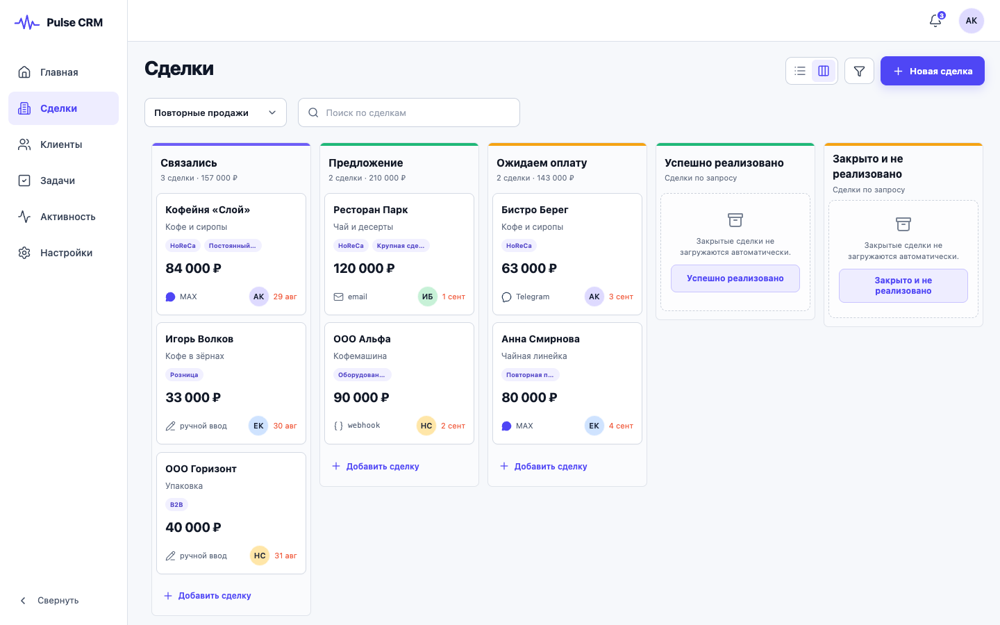
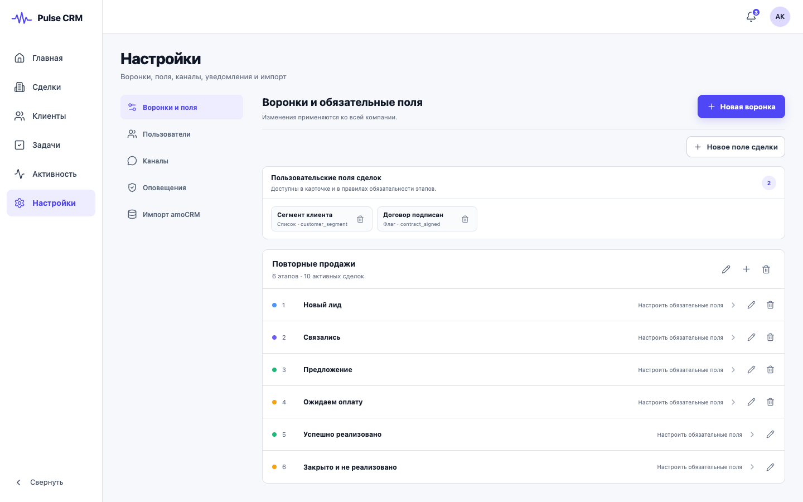
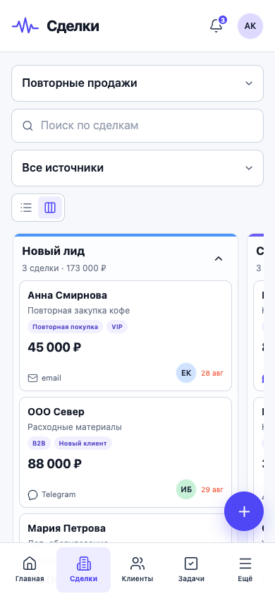
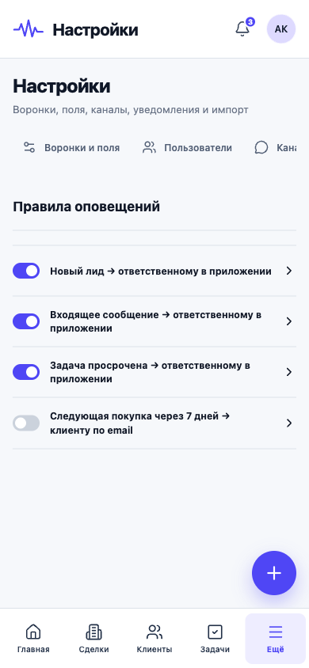
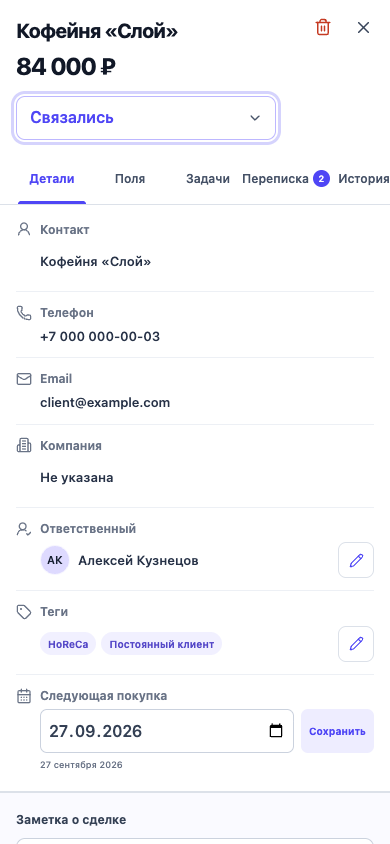
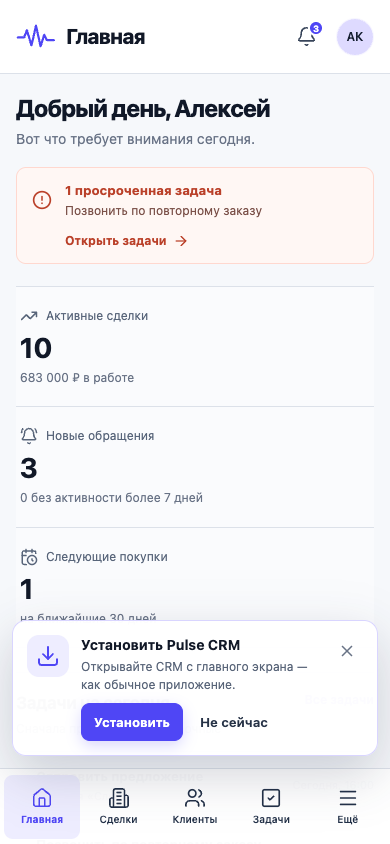
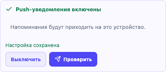

<!--
  Канонический источник пользовательской документации Pulse CRM.
  При изменении интерфейса обновляйте этот файл и изображения в screenshots/.
-->

# Pulse CRM: руководство пользователя

Пошаговое руководство для сотрудников, менеджеров, администраторов и владельцев:
от входа и ежедневной работы до настройки воронок, каналов и импорта.

**Версия:** MVP 0.1

**Обновлено:** 31 августа 2026 года

> [!NOTE]
> Скриншоты сделаны в демонстрационном рабочем пространстве. Имена, контакты и
> суммы приведены для примера.

## Содержание

- [Перед началом](#before-start)
- [Вход в Pulse CRM](#sign-in)
- [Навигация и уведомления](#navigation)
- [Главная страница](#home)
- [Сделки](#deals)
  - [Kanban-воронка](#deals-kanban)
  - [Создание сделки](#deals-create)
  - [Список, поиск и фильтры](#deals-list)
  - [Карточка сделки](#deal-card)
  - [Переписка, вложения и история](#deal-messages)
- [Клиенты](#clients)
  - [Контакты и компании](#clients-list)
  - [Карточка контакта](#contact-card)
- [Задачи](#tasks)
- [Активность](#activity)
- [Настройки](#settings)
  - [Воронки и поля](#settings-pipelines)
  - [Обязательные поля этапа](#settings-required-fields)
  - [Пользователи и роли](#settings-users)
  - [Каналы и источники](#settings-channels)
  - [Правила оповещений](#settings-notifications)
  - [Импорт из amoCRM](#settings-import)
  - [Защита от массовой выгрузки](#settings-data-protection)
- [Работа на телефоне](#mobile)
  - [Установка как приложение (PWA)](#pwa-install)
- [Быстрая помощь](#troubleshooting)

## Перед началом

Pulse CRM объединяет сделки, клиентов, задачи, переписку и историю действий в
одном рабочем пространстве.

### Роли и доступ

| Роль | Что видит | Ключевые права |
|---|---|---|
| Владелец | Все разделы | CRM-данные, все настройки, приглашение сотрудников, менеджеров и администраторов |
| Администратор | Все разделы | CRM-данные, воронки, поля, каналы, оповещения, импорт; приглашение менеджеров и сотрудников |
| Менеджер | Все разделы, кроме «Настроек» | Сделки, клиенты, задачи, переписка и активность |
| Сотрудник | Только рабочие разделы и назначенные ему записи | Свои сделки, контакты и задачи: создание, редактирование и движение по этапам; без удаления, переназначения, отдельного раздела компаний и настроек |

### Как читать руководство

- Сотруднику или менеджеру: последовательно пройти разделы от [«Входа»](#sign-in) до
  [«Активности»](#activity).
- Владельцу или администратору: дополнительно изучить раздел
  [«Настройки»](#settings).
- На телефоне: использовать нижнее меню; этап сделки менять через список в
  карточке.

> [!IMPORTANT]
> Интерфейс может незначительно отличаться в зависимости от роли, подключённых
> каналов и размера экрана.

## Вход в Pulse CRM

Администратор выдаёт доступ или присылает ссылку-приглашение. После входа
открывается рабочее пространство компании.

*Рисунок 1. Форма входа*

1. Откройте адрес Pulse CRM, который выдал администратор.
2. Введите Email и пароль, затем нажмите **Войти**.
3. Если вы получили приглашение, перейдите по ссылке, укажите имя и задайте
   пароль не короче 12 символов.

> [!TIP]
> Не передавайте пароль коллегам. Каждому сотруднику нужна отдельная учётная
> запись.

## Навигация и уведомления

На компьютере основные разделы расположены слева. В правом верхнем углу
находятся уведомления и меню аккаунта.

*Рисунок 2. Центр уведомлений*

- Меню слева: **Главная**, **Сделки**, **Клиенты**, **Задачи**,
  **Активность** и, для административных ролей, **Настройки**.
- Колокольчик показывает новые лиды, просроченные задачи и напоминания о
  следующей покупке.
- В блоке **Push-уведомления** внутри колокольчика можно включить доставку на
  текущее устройство и сразу отправить тестовое уведомление.
- Аватар открывает данные аккаунта и команду **Выйти**.

## Главная: что требует внимания

Главная страница собирает просроченные задачи, ключевые метрики, свежие события
и состояние воронки.

*Рисунок 3. Главная страница*

- Начните с оранжевого блока: он показывает срочную проблему и ведёт к задачам.
- Метрики **Активные сделки**, **Новые обращения** и **Следующие покупки**
  помогают расставить приоритеты.
- Ссылки **Все задачи**, **Вся история** и **Открыть воронку** ведут к
  детальным спискам.

Для роли **Сотрудник** метрики, задачи и события на главной странице считаются
только по назначенным ему записям.

> [!TIP]
> В текущем MVP новую сделку создавайте через **Сделки → Новая сделка**.

## Сделки

Раздел **Сделки** показывает обращения в виде Kanban-воронки или адаптивного
списка карточек. Оба вида открывают одну и ту же карточку сделки.

### Kanban-воронка

Воронка показывает, на каком этапе находится каждая сделка. На карточке видны
теги, сумма, источник, ответственный и срок.

*Рисунок 4. Kanban-воронка сделок*

1. Выберите воронку в списке слева от строки поиска.
2. Найдите сделку по названию, потребности, источнику или тегу.
3. Этапы всегда расположены в одну строку: прокручивайте воронку
   по горизонтали на телефоне, планшете или компьютере. На компьютере
   перетащите карточку в нужную колонку. На телефоне откройте карточку
   касанием и меняйте этап в списке **Этап сделки**.
4. Сделки в финальных этапах не загружаются автоматически. Чтобы
   увидеть их, нажмите в колонке кнопку с фактическим названием этапа,
   например **Закрыто и не реализовано** или **Успешно реализовано**.

> [!WARNING]
> Если переход не выполнился, заполните поля, которые CRM показала как
> обязательные, и повторите смену этапа.

### Создание сделки

Новая сделка попадает на первый этап выбранной воронки.

*Рисунок 5. Форма «Новая сделка»*

1. Откройте **Сделки** и нажмите **Новая сделка**. На телефоне используйте
   круглую кнопку **+** над нижним меню.
2. Заполните **Название**, **Потребность** и **Сумма, ₽**.
3. Укажите источник: ручной ввод, Email, Telegram, MAX, Webhook или HTML-форма.
4. Нажмите **Создать сделку** и откройте её карточку для дополнения.

У сотрудника новая сделка автоматически назначается на него. Выбрать другого
ответственного или оставить сделку без ответственного он не может.

### Список, поиск и фильтры

Переключатель в верхней части экрана меняет Kanban на список карточек. Фильтр
по источнику помогает быстро выделить нужные обращения.

*Рисунок 6. Список сделок с тегами*

- Кнопка **Список** показывает каждую сделку отдельной карточкой: название,
  этап, сумму, источник, срок и ответственного. На большом экране данные
  распределяются по устойчивой сетке внутри карточки, а на телефоне
  перестраиваются в один компактный поток без горизонтальной прокрутки и
  наложения столбцов.
- Нажмите **Фильтры** и выберите источник или оставьте **Все источники**.
- Поиск учитывает название, описание, источник и теги сделки.
- Нажмите на строку, чтобы открыть карточку сделки.

### Карточка сделки

Карточка разделена на вкладки **Детали**, **Поля**, **Задачи**, **Переписка** и
**История**, чтобы разные типы данных не смешивались.

*Рисунок 7. Детали сделки и отдельный блок внутренней заметки*

- Выберите **Этап сделки**, если её нужно переместить без перетаскивания.
- В строке **Ответственный** владелец, администратор или менеджер может нажать
  карандаш, выбрать сотрудника рабочего пространства или **Не назначен**, затем
  сохранить изменение. У сотрудника ответственный зафиксирован.
- В строке **Теги** нажмите кнопку-карандаш, перечислите теги через запятую и
  сохраните. Тем же карандашом изменяются связанные контакт и компания.
  Пустые значения и повторы удаляются автоматически; на Kanban показываются
  первые два тега и счётчик остальных.
- Укажите дату **Следующая покупка** и нажмите **Сохранить**.
- Во вкладке **Детали** находятся связи, ответственный, теги, следующая
  покупка и заметки. Во вкладке **Поля** находятся только пользовательские
  поля сделки.
- Во вкладке **Задачи** нажатие на кнопку статуса меняет задачу между открытой
  и выполненной.
- Внизу **Деталей** добавьте внутреннюю заметку. При необходимости прикрепите
  до пяти файлов, каждый размером не более 20 МБ. Перед сохранением лишний
  файл можно убрать крестиком.
- Корзина в заголовке карточки открывает отдельное подтверждение удаления.
  После подтверждения сделка исчезает из активных списков; восстановить её из
  интерфейса нельзя. Запланированная для неё следующая покупка, уже созданная
  по этому расписанию открытая задача и ещё не отправленные напоминания
  отменяются.

Роль **Сотрудник** может менять этап и данные только своей сделки, добавлять к
ней заметки и работать с перепиской. Корзина для этой роли скрыта, а сервер
отклоняет удаление даже при прямом API-запросе.

> [!IMPORTANT]
> Дата следующей покупки создаёт напоминание, но не создаёт новую сделку
> автоматически.

### Переписка, вложения и история

Вкладка **Переписка** хранит входящие и исходящие сообщения по подключённому
каналу.

*Рисунок 8. Переписка в карточке сделки*

- Откройте **Переписка**, напишите текст и нажмите **Отправить**.
- Для вложения в сообщение нажмите скрепку. Допустимы изображения, PDF, TXT/CSV и
  распространённые офисные форматы до 20 МБ.
- Если отправка завершилась ошибкой, используйте **Повторить** после устранения
  причины.
- Внутренние заметки находятся в **Деталях**, а не в переписке или истории.
  Вложение заметки сохраняется только в CRM и не отправляется клиенту. Чтобы
  открыть такой файл, нажмите его имя в заметке: CRM выдаст временную
  защищённую ссылку.
- Вкладка **История** показывает остальные неизменяемые события по сделке и не
  дублирует заметки.

> [!WARNING]
> Если кнопка отправки недоступна, попросите администратора проверить статус
> канала в **Настройки → Каналы**.

## Клиенты

Раздел **Клиенты** объединяет людей и организации. Сотрудник работает только
со своими контактами; переключатель компаний для него недоступен.

### Контакты и компании

Переключатель справа меняет **Контакты** на **Компании**.

*Рисунок 9. Список контактов*

- Используйте поиск по имени, тегу, телефону или Email. Импортированные
  теги контактов показаны под именем, а теги компаний — в их списке и карточке.
- Нажмите **Новый контакт** и укажите имя, фамилию, Email и телефон.
- Владелец, администратор или менеджер выбирает ответственного за контакт.
  Контакт, созданный сотрудником, автоматически назначается на него.
- Для компании переключите вид на **Компании**, затем укажите название, Email,
  телефон и сайт.
- Контакт и компания удаляются одинаковой кнопкой-корзиной в заголовке
  карточки с отдельным подтверждением. Удаление недоступно сотруднику и не
  восстанавливается из интерфейса. Если удаляемая компания была связана с
  активными контактами или сделками, записи сохраняются, но связь с компанией
  снимается.
- Сервер загружает по 25 записей. Кнопки **Назад** и **Далее** переключают
  страницы контактов и компаний независимо; новый поиск начинает с первой
  страницы.
- CRM загружает только активную вкладку. Список компаний будет запрошен
  после переключения с **Контактов** на **Компании**, и наоборот.
- Если запрос не выполнился из-за связи, проверьте подключение и нажмите
  **Повторить** в сообщении об ошибке.
- Если у контакта нет реально назначенного ответственного, CRM показывает
  **Не назначен**, а не подставляет другого сотрудника.

### Карточка контакта

Карточка контакта показывает связи, теги, накопленную выручку, число покупок,
плановую дату и историю.

*Рисунок 10. Карточка контакта*

1. Нажмите на строку клиента, чтобы открыть карточку.
2. Нажмите **Редактировать**, чтобы изменить имя, фамилию, основной Email,
   телефон или теги. После сохранения список и карточка обновятся сразу.
3. Кнопка-корзина доступна владельцу, администратору и менеджеру и открывает
   подтверждение. После подтверждения контакт исчезнет из активного списка;
   отменить это действие из интерфейса нельзя. Сотрудник может редактировать
   свой контакт, но не может его удалить или переназначить.
4. Блок **История покупок** собирает выигранные сделки, связанные с контактом.
5. В поле **Добавить заметку** зафиксируйте договорённость и нажмите
   **Добавить**.

## Задачи

Раздел **Задачи** помогает планировать звонки, встречи и напоминания о
следующей покупке.

*Рисунок 11. Список задач: строка открывает редактор, название сделки — её карточку*

1. По умолчанию список показывает только открытые задачи. Нажмите
   **Показать закрытые**, чтобы добавить выполненные и отменённые задачи в
   список, и **Скрыть закрытые**, чтобы снова оставить только активные.
2. Отфильтруйте список: **Все**, **Сегодня**, **Просрочено** или
   **Предстоящие**; строка поиска проверяет название, описание и ответственного
   по всему списку до разделения на страницы. На телефоне фильтр открывается
   как системный список выбора без горизонтальной прокрутки.
3. Используйте **Назад** и **Далее** под списком: сервер возвращает по 25 задач,
   а переключение фильтра, поиск, создание задачи или изменение видимости
   закрытых возвращает на первую страницу.
4. Нажмите **Новая задача**; на телефоне — круглую кнопку **+** над нижним
   меню. Заполните название, тип, срок, напоминание и исполнителя.
5. При необходимости выберите сделку или оставьте **Без привязки**, затем
   нажмите **Создать задачу**.
6. Нажмите круглую кнопку статуса слева, чтобы завершить задачу; повторное
   нажатие вернёт её в работу.
7. Нажмите на любую свободную область строки задачи, чтобы открыть
   редактирование названия, описания, типа, срока, напоминания, исполнителя и
   связанной сделки — отдельной кнопки-карандаша нет.
8. Если задача связана со сделкой, нажмите название сделки в строке: CRM
   перейдёт в раздел **Сделки** и откроет нужную карточку, даже когда она не на
   текущей странице списка.
9. Корзина открывает подтверждение удаления. После подтверждения задача
   удаляется без возможности восстановления.

Сотрудник видит и редактирует только назначенные ему задачи. Новая задача
автоматически назначается на него, выбрать другого исполнителя нельзя. Корзина
для сотрудника недоступна; завершать и возвращать в работу свои задачи можно.

## Активность

Журнал активности — это неизменяемая история действий команды и интеграций.
Сотрудник видит только события по доступным ему сделкам, контактам и задачам;
технические идентификаторы связанных чужих объектов ему не показываются.

*Рисунок 12. Журнал активности*

- Найдите событие по тексту в строке **Поиск по событиям**.
- Откройте **Фильтры** и выберите: все события, сделки, сообщения, задачи,
  контакты или система.
- Используйте журнал для проверки, кто и когда создал клиента, переместил
  сделку, выполнил задачу или получил сообщение.

## Настройки

Раздел **Настройки** виден только владельцу и администратору. Изменения
применяются ко всей компании.

### Воронки и поля

*Рисунок 13. Воронки и поля*

- **Новая воронка** создаёт готовый набор рабочих и финальных этапов. Название
  воронки должно быть уникальным.
- В заголовке воронки нажмите карандаш, чтобы изменить её название. Кнопка
  **+** добавляет рабочий этап с выбранными названием и цветом — в конец
  рабочих этапов, перед финальными. В одной воронке может быть до 50 этапов.
- Карандаш в строке этапа изменяет название и цвет. Корзина доступна только для
  рабочего этапа и удаляет его, если он нигде не используется.
- Финальные этапы **Успешно** и **Закрыто** можно переименовать, но нельзя
  удалить. В каждой воронке должен остаться хотя бы один рабочий этап.
- Корзина у воронки удаляет её только тогда, когда есть другая активная воронка
  и нет сделок, истории переходов, связанных каналов, форм, webhook-ов или
  правил оповещений.
- **Новое поле сделки** добавляет текст, число, дату, флаг или список в карточку
  сделки.
- Корзина рядом с полем удаляет его из карточек сделок и из требований
  этапов. Уже сохранённые в сделках значения остаются в исторических данных,
  а технический ключ удалённого поля нельзя использовать повторно. Повторный
  импорт из amoCRM не возвращает такое поле в активный каталог.
- Нажмите на этап, чтобы определить поля, без которых переход дальше будет
  заблокирован.

> [!IMPORTANT]
> Входящий лид не теряется из-за незаполненных полей; ограничение срабатывает
> при следующей смене этапа.

> [!WARNING]
> Если CRM отказала в удалении, прочитайте сообщение, перенесите сделки и
> перенастройте указанные зависимости. После обновления данных повторите
> действие. Если объект одновременно изменил другой администратор, CRM обновит
> данные — повторите операцию с актуальной версией.

### Обязательные поля этапа

Выберите встроенные и пользовательские поля, которые пользователь сделки — в
том числе сотрудник — должен заполнить до перехода на следующий этап.

*Рисунок 14. Редактор обязательных полей*

1. Отметьте нужные поля в группах **Встроенные поля** и
   **Пользовательские поля сделки**.
2. Нажмите **Сохранить обязательность**.

### Пользователи и роли

Приглашение действует 72 часа. Владелец может приглашать администраторов,
менеджеров и сотрудников; администратор — менеджеров и сотрудников.

*Рисунок 15. Редактирование пользователей и приглашения*

1. Откройте **Настройки → Пользователи**.
2. Введите Email сотрудника и выберите роль.
3. Нажмите **Создать приглашение**, скопируйте готовую ссылку и передайте её
   только адресату.
4. Чтобы изменить действующего пользователя, нажмите его строку в списке,
   исправьте имя или роль и сохраните. Email служит идентификатором входа и в
   этом редакторе не меняется.

Администратор может менять менеджеров и сотрудников, но не владельцев и других
администраторов. Владелец не может понизить собственную роль и оставить рабочее
пространство без активного владельца. Если карточку одновременно изменил другой
администратор, CRM обновит данные и предложит повторить операцию.

Выбирайте роль **Сотрудник**, когда человеку нужны только назначенные ему
сделки, контакты и задачи без удаления и доступа к настройкам. Сначала
пользователь должен принять приглашение; затем назначьте ему нужные сделки,
контакты и задачи. Особо проверьте старые контакты: записи без ответственного
или с другим ответственным для сотрудника невидимы.

> [!CAUTION]
> Ссылка даёт доступ к созданию учётной записи. Не публикуйте её в общих чатах
> или открытых документах.

### Каналы и источники

Каналы связывают входящие обращения и исходящую переписку с воронкой,
начальным этапом и, при необходимости, ответственным.

*Рисунок 16. Изменение канала, маршрута и защищённых реквизитов*

- **Подключить канал**: общая почта IMAP/SMTP, Telegram-бот или MAX-бот.
- **Webhook**: HMAC-защищённый endpoint для внешней системы.
- **HTML-форма**: форма на сайте с ограничением разрешённых доменов.
- В форме подключения выберите любую активную воронку. После смены воронки
  список **Начальный этап** обновится и предложит только её рабочие этапы.
- Перед активацией проверьте реквизиты, выбранный маршрут и тестовое обращение.
- Чтобы изменить подключённый канал, нажмите его строку. Можно исправить
  название, маршрут, ответственного и реквизиты. Сохранённые пароли и токены
  обратно не показываются: оставьте защищённое поле пустым, чтобы сохранить
  прежнее значение, или введите новое для замены.
- Если в маршруте выбран сотрудник, новый контакт и новая сделка назначаются
  ему одновременно. Так входящее обращение сразу появляется в его списках.
- На телефоне корпоративный канал добавляется круглой кнопкой **+** над нижним
  меню; кнопки **Webhook** и **HTML-форма** остаются в строке быстрых действий.

> [!CAUTION]
> Токены, пароли и секреты вводите только в защищённых полях Pulse CRM; не
> добавляйте их в заметки или общие чаты.

### Правила оповещений

Правило связывает событие, получателя, канал, задержку и текст шаблона.

*Рисунок 17. Изменение правила и выбор конкретного внутреннего получателя*

1. Нажмите **Новое правило**, укажите событие, получателя и канал: в
   приложении, Email, Telegram или MAX. На телефоне круглая кнопка **+** над
   нижним меню открывает редактор.
2. Оставьте **Все воронки** или выберите любую активную воронку. Для выбранной
   воронки можно оставить **Все этапы** либо ограничить правило конкретным
   этапом; этапы из других воронок в список не попадают.
3. Для оповещения клиента зафиксируйте основание и подтверждённое согласие на
   конкретный канал.
4. После теста включите правило переключателем; таким же способом его можно
   временно выключить.
5. Чтобы изменить существующее правило, нажмите его основную область — не
   переключатель. Редактор позволяет исправить название, событие, получателя,
   канал, задержку, маршрут и текст шаблона. Безопасная правка внутреннего
   правила сохраняет его состояние. Изменение канала или получателя клиентского
   правила выключает его до повторной проверки согласия.

Тип получателя **Сотрудник** означает внутреннего пользователя рабочего
пространства. После выбора этого типа вместо прежнего технического поля
**Адрес** появляется список **Сотрудник**: выберите конкретного пользователя.
Для него разрешён только канал **В приложении**; если у выбранного пользователя
включён Web Push, такое же разрешённое событие придёт на его устройство. Email,
Telegram и MAX предназначены только для клиента с зафиксированным согласием.

> [!IMPORTANT]
> Клиентское правило создавайте выключенным и активируйте только после проверки
> согласия и адреса.

### Импорт из amoCRM

Импорт предназначен для разового контролируемого переноса воронок, контактов,
компаний, сделок, задач, полей и заметок. Теги контактов, компаний и сделок
переносятся вместе с соответствующей записью. Воронки переносятся вместе с
этапами; одинаковые системные этапы в разных воронках обрабатываются раздельно.

*Рисунок 18. Начальный экран импорта amoCRM*

1. Сначала создайте внешнюю OAuth-интеграцию в amoCRM. Redirect URI должен
   дословно совпадать с адресом, который показывает Pulse CRM.
2. Нажмите **Подключить amoCRM** и введите реквизиты только в защищённую форму
   Pulse CRM. Не добавляйте их в документацию или скриншоты.
3. При необходимости заполните **Сопоставление пользователей (JSON)** парами
   `ID пользователя amoCRM → UUID пользователя Pulse`.
4. Запустите dry-run без записи бизнес-данных, дождитесь статуса **Завершено** и
   проверьте агрегированные количества по сущностям.
5. Для реального переноса снова нажмите **Запустить импорт**, выключите dry-run
   и следите за прогрессом. После завершения скачайте отчёт, если он доступен.
6. Для приостановленного или ошибочного запуска нажмите **Продолжить**: работа
   возобновится с сохранённой страницы без повторного создания записей. Кнопка
   **Повторить** в списке ошибок фоновых заданий относится только к отдельному
   сбойному заданию и используется после устранения причины.

> [!TIP]
> После обновления Pulse CRM повторный импорт безопасно заполняет теги у ранее
> перенесённых сделок. Теги заменяются текущим набором из amoCRM, а сами сделки
> не дублируются.

Сопоставление пользователей определяет ответственных не только у сделок и
задач, но и у контактов. Импорт не создаёт учётные записи Pulse CRM: сначала
пригласите пользователя с нужной ролью и дождитесь принятия, затем укажите его
UUID в сопоставлении и проверьте назначенные ему записи после импорта.
При повторном импорте изменение ответственного или основного контакта сделки
также обновляет связанное напоминание о следующей покупке и открытую задачу.

### Защита от массовой выгрузки

В MVP нет кнопки или API для штатного массового экспорта контактов, компаний и
сделок. Политика экспорта на сервере выключена по умолчанию и доступна только
владельцу; администратор и менеджер не могут включить её через интерфейс.

Быстрое последовательное открытие следующих страниц CRM-списков также
ограничено. Если сервер вернул HTTP 429, дождитесь указанного времени и повторите
обычную операцию; превышение фиксируется в журнале активности.

Это не мешает обычной работе с отдельными доступными пользователю карточками.
Любой человек, которому разрешено видеть данные, всё равно может вручную
скопировать их или сделать снимок экрана. Поэтому каждому сотруднику нужна
собственная учётная запись, а доступ уволенного сотрудника следует немедленно
отозвать.

> [!CAUTION]
> Перед импортом администратор должен создать резервную копию и выполнить
> перенос в запланированное окно.

## Работа на телефоне

Pulse CRM адаптируется к телефону и планшету. На маленьком экране основная
навигация переносится вниз.

*Рисунок 19. Сделки в мобильной Kanban-воронке*

- Используйте нижнее меню: **Главная**, **Сделки**, **Клиенты**, **Задачи** и
  **Ещё**.
- В Kanban листайте этапы горизонтально; колонки не переносятся на
  следующую строку. Карточки внутри этапа прокручиваются
  вместе со страницей; перетаскивание на телефоне не используется.
- Круглая кнопка **+** добавляет разрешённый для роли объект — сделку, контакт,
  компанию, задачу, канал или правило оповещения в зависимости от открытого
  раздела. Сотруднику доступны только сделка, контакт и задача. Кнопка
  расположена над нижним меню и не перекрывает навигацию.
- В задачах выбирайте статус через системный список **Все / Сегодня /
  Просрочено / Предстоящие**.
- Пункт **Ещё** ведёт в **Настройки** для владельца или администратора и в
  **Активность** для менеджера или сотрудника.

*Рисунок 20. Плавающая кнопка добавления в мобильных настройках*

*Рисунок 21. Вкладки и детали сделки на телефоне*

В карточке сделки подписи находятся над значениями, поэтому длинные данные не
накладываются друг на друга. Для редактирования используйте карандаш, а
пользовательские поля открывайте в отдельной вкладке **Поля**. Заметки и их
внутренние вложения находятся в **Деталях**. Поля ввода не увеличивают масштаб
страницы автоматически; обычное ручное масштабирование остаётся доступно.

### Установка как приложение (PWA)

После входа Pulse CRM предлагает добавить приложение на главный экран, если
браузер поддерживает установку и CRM ещё не запущена как отдельное приложение.

*Рисунок 22. Предложение установки Pulse CRM*

- На Android и в совместимом Chromium-браузере нажмите **Установить**, затем
  подтвердите системное окно.
- На iPhone или iPad откройте меню **Поделиться** и выберите **На экран
  «Домой»** — подсказка в Pulse CRM напомнит эти шаги.
- Кнопки **Не сейчас**, **Понятно** или крестик скрывают предложение на 30
  дней. Установить приложение позднее можно через меню браузера.

Установленная Pulse CRM открывается в отдельном окне, но продолжает работать
через интернет. Сделки, контакты и ответы API не сохраняются для офлайн-доступа.

#### Push-уведомления

Push настраиваются отдельно на каждом телефоне, планшете или компьютере:

1. Откройте колокольчик и в блоке **Push-уведомления** нажмите **Включить**.
2. Разрешите уведомления в системном окне браузера. Pulse CRM запрашивает это
   разрешение только после нажатия кнопки.
3. Нажмите **Проверить**. Уведомление может появиться, даже если окно CRM
   свёрнуто или закрыто.

*Рисунок 23. Настройка push-уведомлений для текущего устройства*

Push повторяют персональные события сотрудника, для которых администратор
включил канал **В приложении**. Клиентские email и сообщения в мессенджерах в
push не копируются. Нажатие на уведомление о сделке или задаче открывает именно
эту карточку, даже если запись не находится на первой странице списка или в
текущей воронке. Для входящего сообщения открывается связанная сделка, а для
напоминания о следующей покупке — созданная по расписанию задача. Если сеанс
истёк, после входа Pulse CRM возвращает пользователя к карточке. Тестовое
уведомление открывает главную страницу.

Команда **Выключить** удаляет подписку текущего браузера; при обычном выходе из
аккаунта Pulse CRM также отключает это устройство. Если объект уже удалён или
недоступен в текущем рабочем пространстве, приложение остаётся в его разделе и
показывает, что карточку открыть не удалось.

На iPhone и iPad push доступны только в Pulse CRM, установленной через
**Поделиться → На экран «Домой»** (iOS/iPadOS 16.4 или новее). Если уведомления
были запрещены, разрешите их для Pulse CRM в настройках браузера или системы,
а затем откройте блок снова.

## Быстрая помощь

| Ситуация | Что делать |
|---|---|
| Нет «Настроек» | Это нормально для ролей «Менеджер» и «Сотрудник»; обратитесь к владельцу или администратору. |
| Сотрудник не видит контакт, сделку или задачу | Проверьте, что именно этот сотрудник указан ответственным. Контакты без ответственного ему не показываются. |
| Нет кнопки удаления или выбора ответственного | Для роли «Сотрудник» удаление и переназначение запрещены. Это не ошибка интерфейса. |
| Сделка не меняет этап | Заполните перечисленные CRM обязательные поля и повторите действие. |
| Воронка или этап не удаляется | Объект используется сделками, историей или настройками. Перенесите данные и перенастройте указанные CRM зависимости. |
| Импорт amoCRM остановился с ошибкой | Передайте текст ошибки администратору. После исправления причины откройте тот же запуск и нажмите **Продолжить**. |
| Данные устарели | Обновите страницу, снова откройте карточку и повторите изменение. |
| Сообщение не отправляется | Проверьте канал и адрес получателя; после исправления нажмите **Повторить**. |
| Вложение отклонено | Проверьте формат и размер: архивы и исполняемые файлы не принимаются, лимит — 20 МБ. |
| Нет предложения установить приложение | Проверьте HTTPS, обновите страницу и меню браузера. Предложение не показывается, если приложение уже установлено или было отклонено менее 30 дней назад. |
| Push недоступны или не приходят | Установите PWA на iPhone/iPad, проверьте системное разрешение, сеть и кнопку **Проверить**. Если сервер отключил push, обратитесь к администратору. |

> [!TIP]
> Для ежедневной работы достаточно цикла: **Главная → срочные задачи → Сделки
> → обновление карточек → Активность**.
