<!--
  Канонический источник пользовательской документации Pulse CRM.
  При изменении интерфейса обновляйте этот файл и изображения в screenshots/.
-->

# Pulse CRM: руководство пользователя

Пошаговое руководство для менеджеров, администраторов и владельцев: от входа
и ежедневной работы до настройки воронок, каналов и импорта.

**Версия:** MVP 0.1

**Обновлено:** 28 августа 2026 года

> [!NOTE]
> Скриншоты сделаны в демонстрационном рабочем пространстве. Имена, контакты и
> суммы приведены для примера.

## Содержание

- [Перед началом](#before-start)
- [Вход в Pulse CRM](#sign-in)
- [Навигация и уведомления](#navigation)
- [Главная страница](#home)
- [Сделки](#deals)
  - [Kanban-воронка](#deals-kanban)
  - [Создание сделки](#deals-create)
  - [Список, поиск и фильтры](#deals-list)
  - [Карточка сделки](#deal-card)
  - [Переписка, вложения и история](#deal-messages)
- [Клиенты](#clients)
  - [Контакты и компании](#clients-list)
  - [Карточка контакта](#contact-card)
- [Задачи](#tasks)
- [Активность](#activity)
- [Настройки](#settings)
  - [Воронки и поля](#settings-pipelines)
  - [Обязательные поля этапа](#settings-required-fields)
  - [Пользователи и роли](#settings-users)
  - [Каналы и источники](#settings-channels)
  - [Правила оповещений](#settings-notifications)
  - [Импорт из amoCRM](#settings-import)
- [Работа на телефоне](#mobile)
- [Быстрая помощь](#troubleshooting)

## Перед началом

Pulse CRM объединяет сделки, клиентов, задачи, переписку и историю действий в
одном рабочем пространстве.

### Роли и доступ

| Роль | Что видит | Ключевые права |
|---|---|---|
| Владелец | Все разделы | CRM-данные, все настройки, приглашение менеджеров и администраторов |
| Администратор | Все разделы | CRM-данные, воронки, поля, каналы, оповещения, импорт; приглашение менеджеров |
| Менеджер | Все разделы, кроме «Настроек» | Сделки, клиенты, задачи, переписка и активность |

### Как читать руководство

- Менеджеру: последовательно пройти разделы от [«Входа»](#sign-in) до
  [«Активности»](#activity).
- Владельцу или администратору: дополнительно изучить раздел
  [«Настройки»](#settings).
- На телефоне: использовать нижнее меню; этап сделки менять через список в
  карточке.

> [!IMPORTANT]
> Интерфейс может незначительно отличаться в зависимости от роли, подключённых
> каналов и размера экрана.

## Вход в Pulse CRM

Администратор выдаёт доступ или присылает ссылку-приглашение. После входа
открывается рабочее пространство компании.

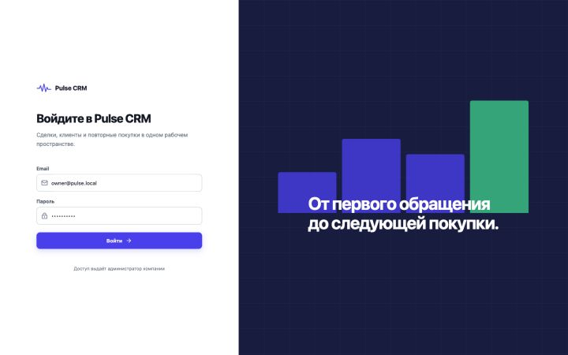

*Рисунок 1. Форма входа*

1. Откройте адрес Pulse CRM, который выдал администратор.
2. Введите Email и пароль, затем нажмите **Войти**.
3. Если вы получили приглашение, перейдите по ссылке, укажите имя и задайте
   пароль не короче 12 символов.

> [!TIP]
> Не передавайте пароль коллегам. Каждому сотруднику нужна отдельная учётная
> запись.

## Навигация и уведомления

На компьютере основные разделы расположены слева. В правом верхнем углу
находятся уведомления и меню аккаунта.

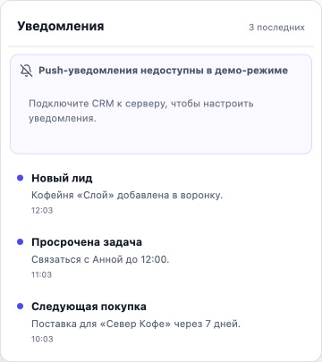

*Рисунок 2. Центр уведомлений*

- Меню слева: **Главная**, **Сделки**, **Клиенты**, **Задачи**,
  **Активность** и, для административных ролей, **Настройки**.
- Колокольчик показывает новые лиды, просроченные задачи и напоминания о
  следующей покупке.
- Аватар открывает данные аккаунта и команду **Выйти**.

## Главная: что требует внимания

Главная страница собирает просроченные задачи, ключевые метрики, свежие события
и состояние воронки.

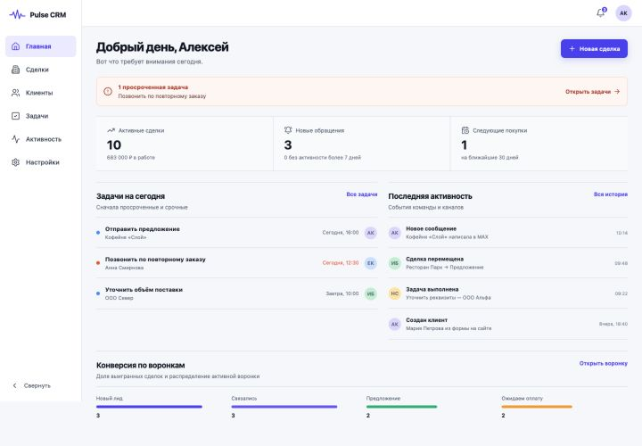

*Рисунок 3. Главная страница*

- Начните с оранжевого блока: он показывает срочную проблему и ведёт к задачам.
- Метрики **Активные сделки**, **Новые обращения** и **Следующие покупки**
  помогают расставить приоритеты.
- Ссылки **Все задачи**, **Вся история** и **Открыть воронку** ведут к
  детальным спискам.

> [!TIP]
> В текущем MVP новую сделку создавайте через **Сделки → Новая сделка**.

## Сделки

Раздел **Сделки** показывает обращения в виде Kanban-воронки или таблицы. Оба
вида используют одну карточку сделки.

### Kanban-воронка

Воронка показывает, на каком этапе находится каждая сделка. На карточке видны
сумма, источник, ответственный и срок.

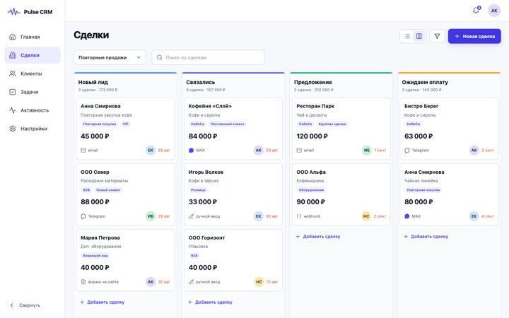

*Рисунок 4. Kanban-воронка сделок*

1. Выберите воронку в списке слева от строки поиска.
2. Найдите сделку по названию, потребности или источнику.
3. На компьютере перетащите карточку в нужную колонку. На телефоне меняйте этап
   в карточке сделки.

> [!WARNING]
> Если переход не выполнился, заполните поля, которые CRM показала как
> обязательные, и повторите смену этапа.

### Создание сделки

Новая сделка попадает на первый этап выбранной воронки.

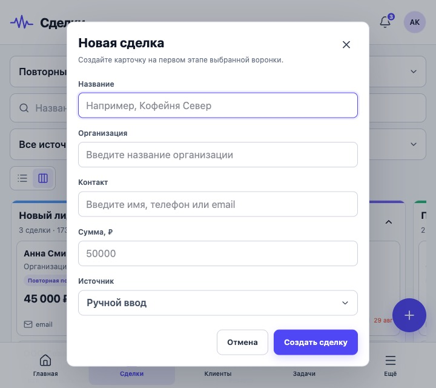

*Рисунок 5. Форма «Новая сделка»*

1. Откройте **Сделки** и нажмите **Новая сделка**.
2. Заполните **Название**, **Потребность** и **Сумма, ₽**.
3. Укажите источник: ручной ввод, Email, Telegram, MAX, Webhook или HTML-форма.
4. Нажмите **Создать сделку** и откройте её карточку для дополнения.

### Список, поиск и фильтры

Переключатель в верхней части экрана меняет Kanban на табличный список. Фильтр
по источнику помогает быстро выделить нужные обращения.

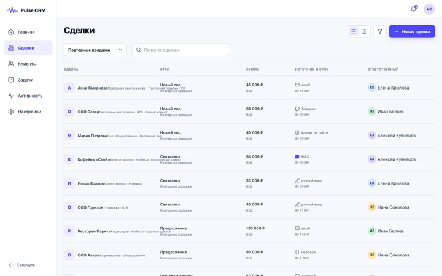

*Рисунок 6. Список сделок с фильтром Telegram*

- Кнопка **Список** показывает этап, сумму, источник, срок и ответственного в
  одной строке.
- Нажмите **Фильтры** и выберите источник или оставьте **Все источники**.
- Нажмите на строку, чтобы открыть карточку сделки.

### Карточка сделки

В карточке собраны контакты, этап, ответственный, следующая покупка, задачи,
переписка и история.

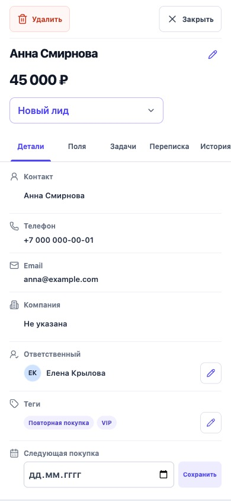

*Рисунок 7. Карточка сделки на вкладке «Детали»*

- Выберите **Этап сделки**, если её нужно переместить без перетаскивания.
- Укажите дату **Следующая покупка** и нажмите **Сохранить**.
- Нажатие на задачу меняет её состояние между открытой и выполненной.

> [!IMPORTANT]
> Дата следующей покупки создаёт напоминание, но не создаёт новую сделку
> автоматически.

### Переписка, вложения и история

Вкладка **Переписка** хранит входящие и исходящие сообщения по подключённому
каналу.

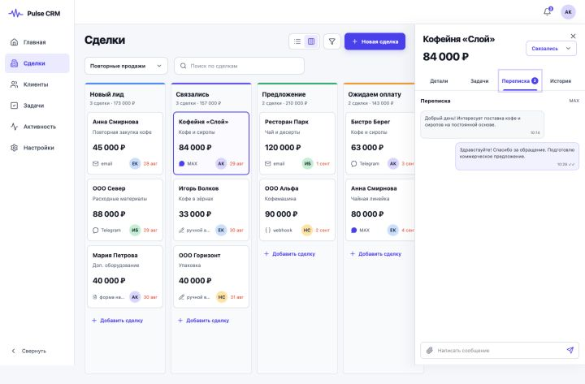

*Рисунок 8. Переписка в карточке сделки*

- Откройте **Переписка**, напишите текст и нажмите **Отправить**.
- Для вложения нажмите скрепку. Допустимы изображения, PDF, TXT/CSV и
  распространённые офисные форматы до 20 МБ.
- Если отправка завершилась ошибкой, используйте **Повторить** после устранения
  причины.
- Во вкладке **История** можно добавить заметку; записи в ленте не
  редактируются.

> [!WARNING]
> Если кнопка отправки недоступна, попросите администратора проверить статус
> канала в **Настройки → Каналы**.

## Клиенты

Раздел **Клиенты** объединяет людей и организации.

### Контакты и компании

Переключатель справа меняет **Контакты** на **Компании**.

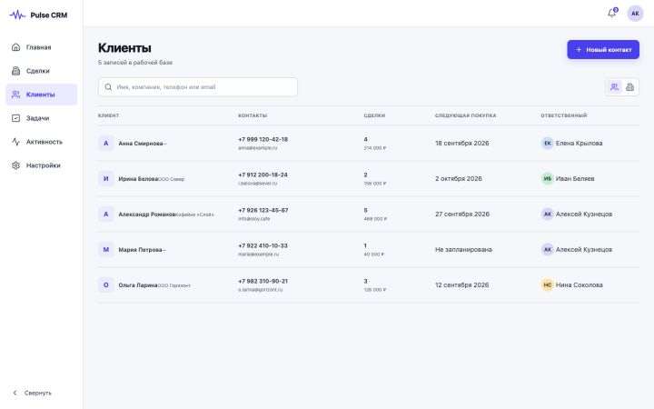

*Рисунок 9. Список контактов*

- Используйте поиск по имени, компании, телефону или Email.
- Нажмите **Новый контакт** и укажите имя, фамилию, Email и телефон.
- Для компании переключите вид на **Компании**, затем укажите название, Email,
  телефон и сайт.

### Карточка контакта

Карточка контакта показывает связи, накопленную выручку, число покупок,
плановую дату и историю.

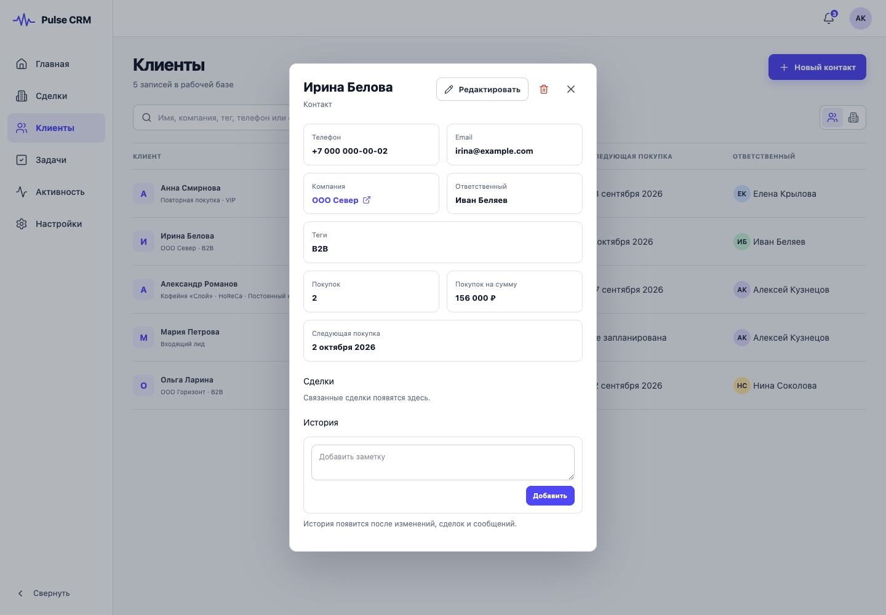

*Рисунок 10. Карточка контакта*

1. Нажмите на строку клиента, чтобы открыть карточку.
2. Блок **История покупок** собирает выигранные сделки, связанные с контактом.
3. В поле **Добавить заметку** зафиксируйте договорённость и нажмите
   **Добавить**.

## Задачи

Раздел **Задачи** помогает планировать звонки, встречи и напоминания о
следующей покупке.

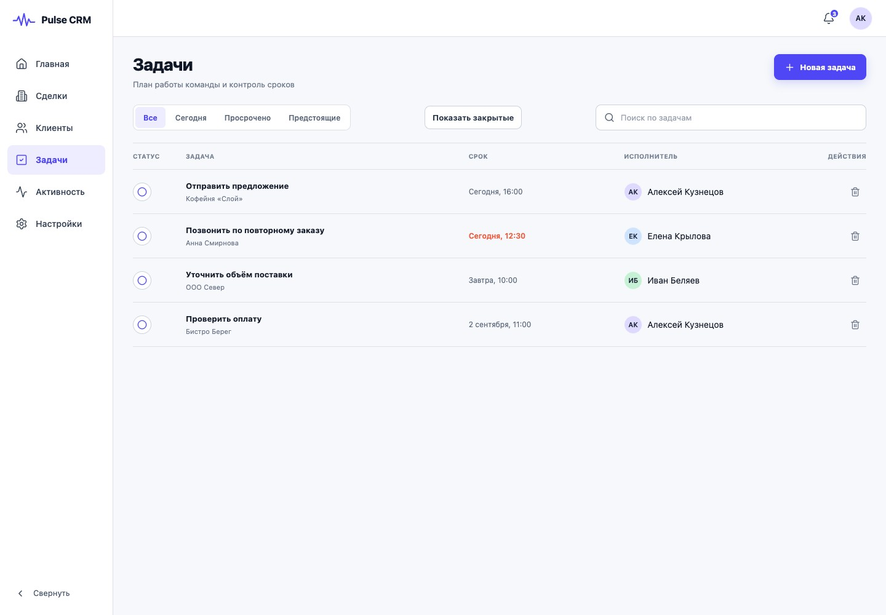

*Рисунок 11. Форма «Новая задача»*

1. Отфильтруйте список: **Все**, **Сегодня**, **Просрочено** или
   **Предстоящие**; для точного поиска используйте строку поиска.
2. Нажмите **Новая задача** и заполните название, тип, срок, напоминание и
   исполнителя.
3. При необходимости выберите сделку или оставьте **Без привязки**, затем
   нажмите **Создать задачу**.
4. Нажмите на строку задачи, чтобы отметить её выполненной; повторное нажатие
   вернёт её в работу.

## Активность

Журнал активности — это неизменяемая история действий команды и интеграций.

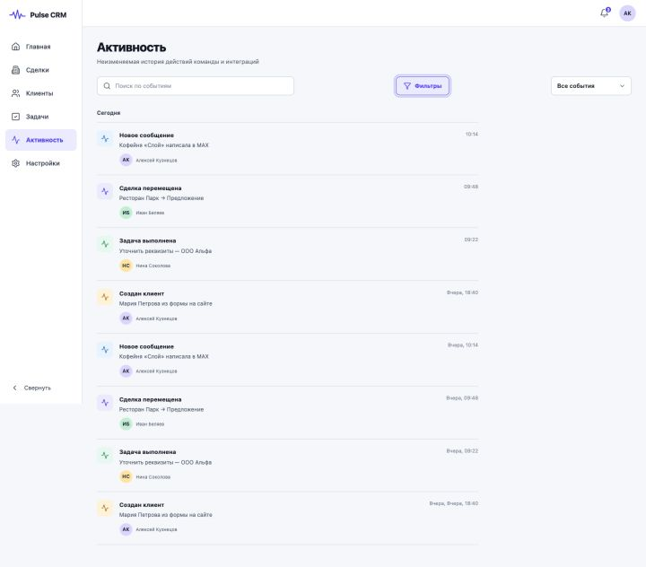

*Рисунок 12. Журнал активности*

- Найдите событие по тексту в строке **Поиск по событиям**.
- Откройте **Фильтры** и выберите: все события, сделки, сообщения, задачи,
  контакты или система.
- Используйте журнал для проверки, кто и когда создал клиента, переместил
  сделку, выполнил задачу или получил сообщение.

## Настройки

Раздел **Настройки** виден только владельцу и администратору. Изменения
применяются ко всей компании.

### Воронки и поля

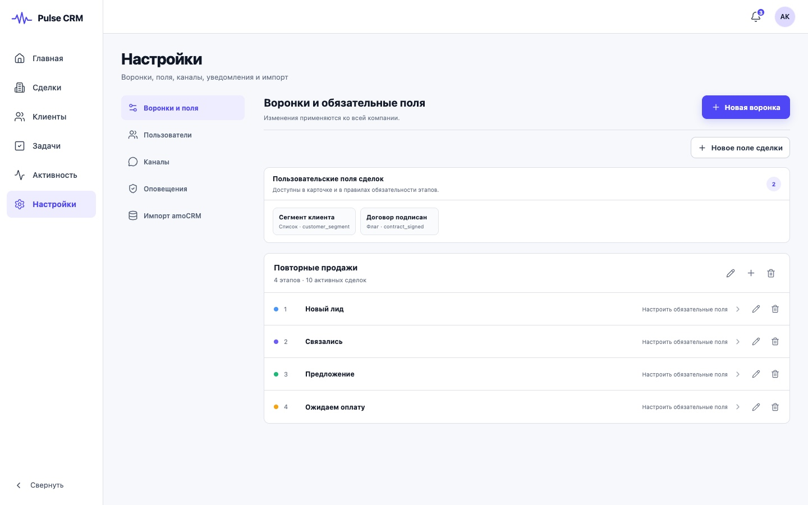

*Рисунок 13. Воронки и поля*

- **Новая воронка** создаёт готовый набор открытых и системных этапов.
- Кнопка с карандашом у воронки меняет её название; кнопка **+** добавляет
  новый открытый этап.
- У этапа можно изменить название. Удалить можно только пустой открытый этап;
  этапы **Успешно** и **Закрыто** защищены, а последний открытый этап удалить
  нельзя.
- Корзина у воронки удаляет её только тогда, когда есть другая воронка и нет
  связанных сделок, каналов, форм, webhook-ов или правил оповещений.
- **Новое поле сделки** добавляет текст, число, дату, флаг или список в карточку
  сделки.
- Нажмите на этап, чтобы определить поля, без которых переход дальше будет
  заблокирован.

> [!IMPORTANT]
> Входящий лид не теряется из-за незаполненных полей; ограничение срабатывает
> при следующей смене этапа.

> [!WARNING]
> Если CRM отказала в удалении, перенесите сделки и перенастройте указанные
> зависимости. После обновления данных повторите действие.

### Обязательные поля этапа

Выберите встроенные и пользовательские поля, которые менеджер должен заполнить
до перехода на следующий этап.

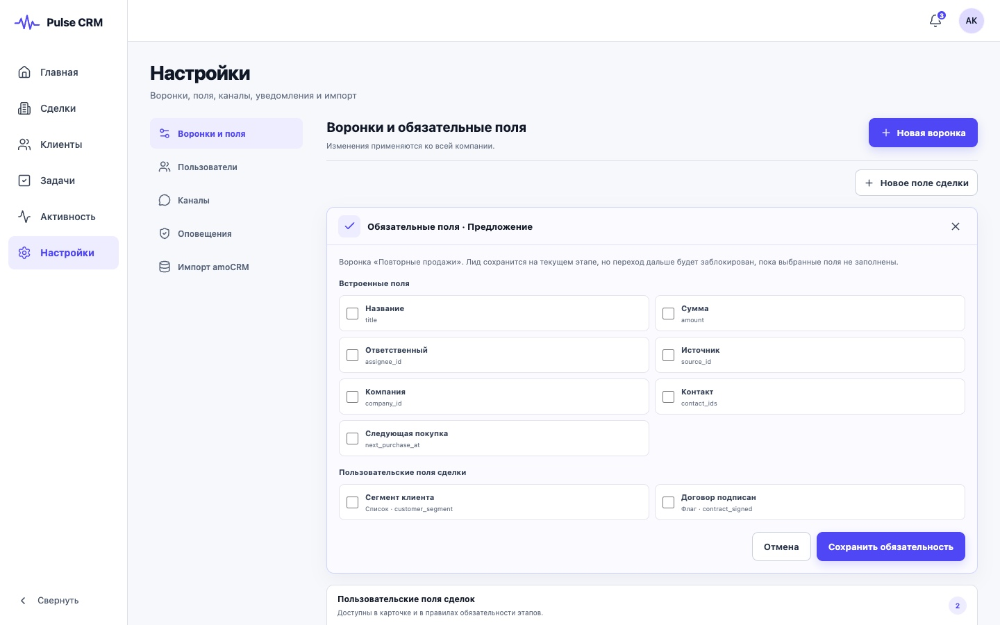

*Рисунок 14. Редактор обязательных полей*

1. Отметьте нужные поля в группах **Встроенные поля** и
   **Пользовательские поля сделки**.
2. Нажмите **Сохранить обязательность**.

### Пользователи и роли

Приглашение действует 72 часа. Владелец может приглашать менеджеров и
администраторов; администратор — только менеджеров.

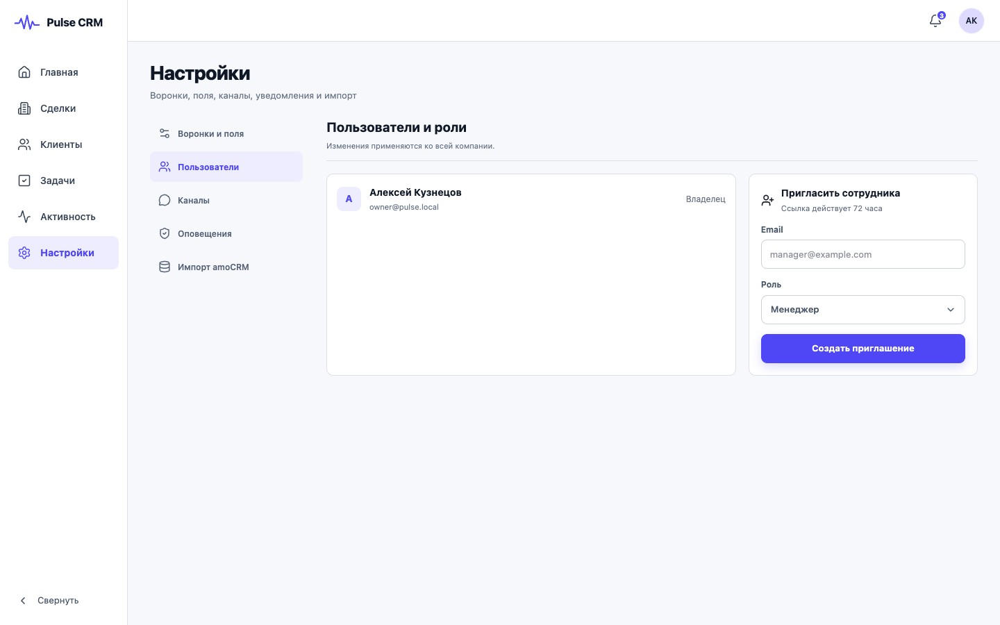

*Рисунок 15. Пользователи и приглашения*

1. Откройте **Настройки → Пользователи**.
2. Введите Email сотрудника и выберите роль.
3. Нажмите **Создать приглашение**, скопируйте готовую ссылку и передайте её
   только адресату.

> [!CAUTION]
> Ссылка даёт доступ к созданию учётной записи. Не публикуйте её в общих чатах
> или открытых документах.

### Каналы и источники

Каналы связывают входящие обращения и исходящую переписку с воронкой,
начальным этапом и, при необходимости, ответственным.

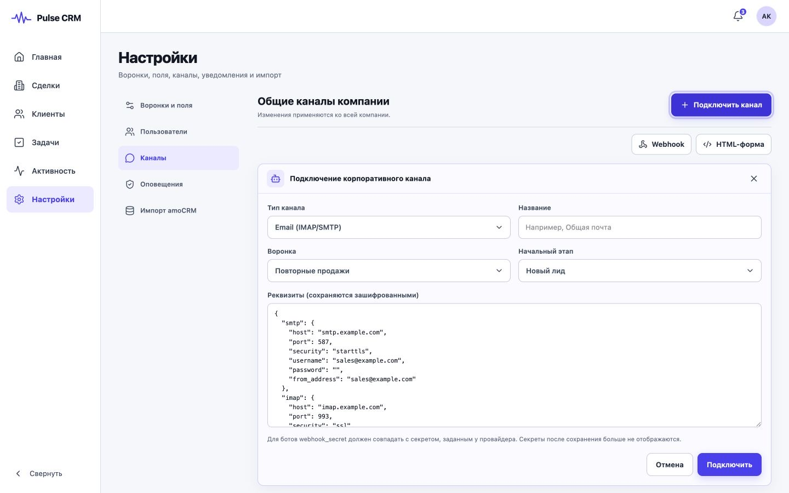

*Рисунок 16. Общие каналы компании*

- **Подключить канал**: общая почта IMAP/SMTP, Telegram-бот или MAX-бот.
- **Webhook**: HMAC-защищённый endpoint для внешней системы.
- **HTML-форма**: форма на сайте с ограничением разрешённых доменов.
- Перед активацией проверьте реквизиты, маршрут в воронку и тестовое обращение.

> [!CAUTION]
> Токены, пароли и секреты вводите только в защищённых полях Pulse CRM; не
> добавляйте их в заметки или общие чаты.

### Правила оповещений

Правило связывает событие, получателя, канал, задержку и текст шаблона.

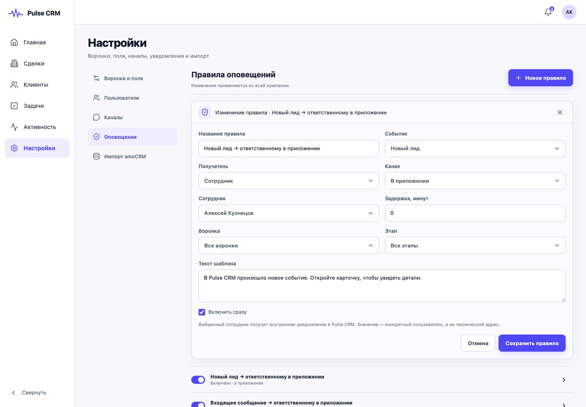

*Рисунок 17. Правила оповещений*

1. Нажмите **Новое правило**, укажите событие, получателя и канал: в
   приложении, Email, Telegram или MAX.
2. Для оповещения клиента зафиксируйте основание и подтверждённое согласие на
   конкретный канал.
3. После теста включите правило переключателем; таким же способом его можно
   временно выключить.

> [!IMPORTANT]
> Клиентское правило создавайте выключенным и активируйте только после проверки
> согласия и адреса.

### Импорт из amoCRM

Импорт предназначен для разового контролируемого переноса воронок, контактов,
компаний, сделок, задач, полей и заметок.

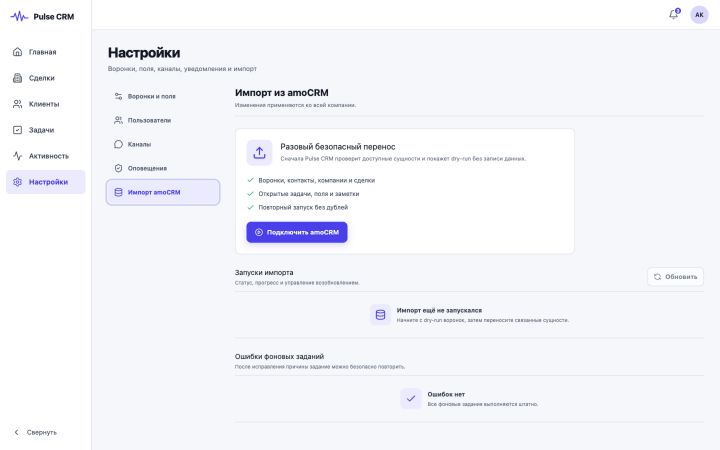

*Рисунок 18. Начальный экран импорта amoCRM*

1. Нажмите **Подключить amoCRM** и заполните реквизиты OAuth-интеграции.
2. Запустите dry-run без записи бизнес-данных и проверьте сопоставление воронок
   и пользователей.
3. После проверки запустите перенос; следите за прогрессом и ошибками, при
   необходимости используйте паузу, продолжение и повтор.

> [!CAUTION]
> Перед импортом администратор должен создать резервную копию и выполнить
> перенос в запланированное окно.

## Работа на телефоне

Pulse CRM адаптируется к телефону и планшету. На маленьком экране основная
навигация переносится вниз.

- Используйте нижнее меню: **Главная**, **Сделки**, **Клиенты**, **Задачи** и
  **Ещё**.
- Открывайте сделку касанием; для смены этапа используйте список
  **Этап сделки**, а не перетаскивание.
- Пункт **Ещё** ведёт в **Настройки** для владельца или администратора и в
  **Активность** для менеджера.

## Быстрая помощь

| Ситуация | Что делать |
|---|---|
| Нет «Настроек» | Это нормально для роли «Менеджер»; обратитесь к владельцу или администратору. |
| Сделка не меняет этап | Заполните перечисленные CRM обязательные поля и повторите действие. |
| Данные устарели | Обновите страницу, снова откройте карточку и повторите изменение. |
| Сообщение не отправляется | Проверьте канал и адрес получателя; после исправления нажмите **Повторить**. |
| Вложение отклонено | Проверьте формат и размер: архивы и исполняемые файлы не принимаются, лимит — 20 МБ. |

> [!TIP]
> Для ежедневной работы достаточно цикла: **Главная → срочные задачи → Сделки
> → обновление карточек → Активность**.
